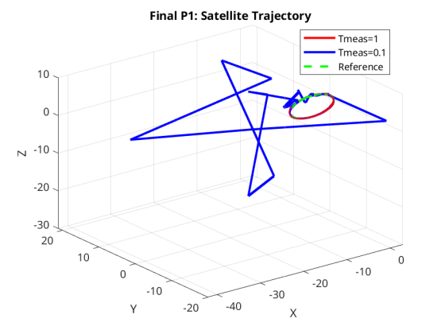
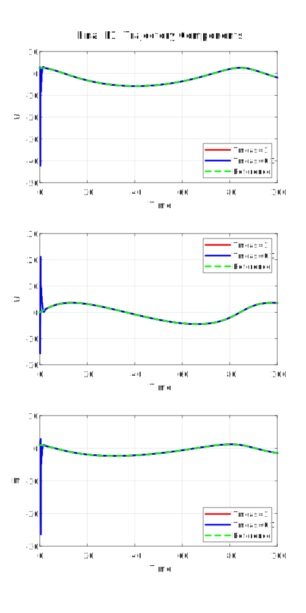
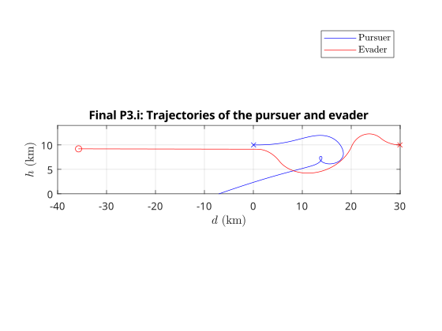

# AE584 Fall 2024 Final Project

# Akshat Dubey

## Problem 1

### Part a

Extended Kalman Filter equations are given by:

#### Prediction Step

$$
\begin{aligned}
\hat{X}_{k+1|k} &= A_k \hat{X}_{k|k} \\
P_{k+1|k} &= A_k P_{k|k} A_k^T + Q_k \\
\text{Where:} \\
A_k &= e^{F(\mathbb{X}_k T_s)} \\
F(\mathbb{X}_k) &= \begin{bmatrix}
0_{3\times3} & I_{3\times3} \\
F_{X_k,Y_k,Z_k} & 0_{3\times3}
\end{bmatrix} \\
F_{X_k,Y_k,Z_k} &= \begin{bmatrix}
\frac{3\mu X_k^2}{r^5} - \frac{\mu}{r^3} & \frac{3\mu X_k Y_k}{r^5} & \frac{3\mu X_k Z_k}{r^5} \\
\frac{3\mu X_k Y_k}{r^5} & \frac{3\mu Y_k^2}{r^5} - \frac{\mu}{r^3} & \frac{3\mu Y_k Z_k}{r^5} \\
\frac{3\mu X_k Z_k}{r^5} & \frac{3\mu Y_k Z_k}{r^5} & \frac{3\mu Z_k^2}{r^5} - \frac{\mu}{r^3}
\end{bmatrix} \\
\mathbb{X}_k &= \begin{bmatrix} X_k \\ Y_k \\ Z_k \\ V_{Xk} \\ V_{Yk} \\ V_{Zk}  \end{bmatrix} \\
T_s &= 0.01 \\
\mu &= 0.4 \\
r &= \sqrt{X_k^2 + Y_k^2 + Z_k^2} \\
Q_k &= \text{Process noise covariance matrix guess, } \mathbb{R}^{6\times6} \\
\end{aligned}
$$

Note: Usually for EKF, $\hat{X}_{k+1|k}$ are calculated using a nonlinear discrete time model, but we dont have that here. We only have a linearized discrete time model so we have to use $A_k$.

$\pagebreak$

#### Update Step

$\\$These equations are run only when a measurement is available, so when $mod((k+1)T_s, T_{meas}) = 0$.

$T_{meas}$ is the interval between measurements.

$$
\begin{aligned}
Y_{k+1} &= g(\mathbb{X}_{k+1}) + D_2 w_{2,k+1} \\
K_k &= P_{k+1|k} C_{k+1}^T (C_{k+1} P_{k+1|k} C_{k+1}^T + R_k)^{-1} \\
\hat{X}_{k+1|k+1} &= \hat{X}_{k+1|k} + K_k (Y_{k+1} - g(\hat{X}_{k+1|k})) \\
P_{k+1|k+1} &= p_{k+1|k} - K_k C_{k+1} P_{k+1|k} \\
\text{Where:} \\
g(\mathbb{X_k}) &= \begin{bmatrix}
\sqrt{X_k^2 + Y_k^2 + Z_k^2} \\
-arctan\frac{X_k}{Y_k} \\
arctan\frac{Z_k}{\sqrt{X_k^2 + Y_k^2}} \\
\end{bmatrix} \\
D_2 &= \begin{bmatrix}
0.01 & 0 & 0 \\
0 & 0.01 & 0 \\
0 & 0 & 0.01 \\
\end{bmatrix} \\
C_{k+1} &= \frac{\partial g}{\partial \mathbb{X}} \bigg|_{\hat{X}_{k+1|k}} \\
R_k &= \text{Measurement noise covariance matrix guess, } \mathbb{R}^{6\times6} \\
\end{aligned}
$$

$\pagebreak$

### Part b

$Q_k$ was chosen to be a close approximation of the actual process noise covariance matrix.

$$
\begin{aligned}
\text{Process noise } &= D_1 w_{1,k} \\
\text{Where:} \\
D_1 &= \begin{bmatrix} 0_{3\times3} \\ 0.01 I_{3\times3} \end{bmatrix} \\
w_{1,k} &\sim \mathcal{N}(0_{3\times1}, I_{3\times3}) \\
\text{Therefore, } Q_k &= D_1 I_{3\times3} D_1^T \\
&= \begin{bmatrix}
0_{3\times3} & 0_{3\times3} \\
0_{3\times3} & 0.0001 I_{3\times3}
\end{bmatrix}
\end{aligned}
$$

$R_k$ was chosen to be a close approximation of the actual measurement noise covariance matrix.

$$
\begin{aligned}
\text{Measurement noise } &= D_2 w_{2,k} \\
\text{Where:} \\
D_2 &= \begin{bmatrix} 0.01 I_{3\times3} \end{bmatrix} \\
w_{2,k} &\sim \mathcal{N}(0_{3\times1}, I_{3\times3}) \\
\text{Therefore, } R_k &= D_2 I_{3\times3} D_2^T = 0.0001 I_{3\times3} \\
\end{aligned}
$$

$\pagebreak$

## Problem 2

### Part i: Engagement using Kinematic Differential Equations

Miss Distance: $0.807745$ m

{ width=50% }

### Part ii: Engagement using Dynamic Differential Equations

Miss Distance: $108723.310354$ m

{ width=70% }

$\pagebreak$

### Part iii: Explanation of difference in miss distance

The difference in the engagements is that the kinematic sulation hits while the dynamic simulation misses.
This is because the dynamic simulation takes into account the acceleration/deceleration of the missile and target due to thrust, drag, and gravity.
The kinematic simulation assumes the velocities $V_P = 900$ m/s and $V_E=450$ m/s without any external forces affecting them.
The kinematic simulation is unrealistic, as seen in the graph because is is impossible for the pursuer to maintain a constant due to limited thrust(limited fuel), drag and gravity.
While the evader F-16 is more likely to maintain a constant velocity for longer due to its ability to carry a lot more fuel and hence provide thrust for a longer time.

$\pagebreak$

## Problem 3

### Part i

Miss distance: $30126.175927$ m

{ width=60% }

{ width=60% }

$\pagebreak$

### Part ii

Miss distance: $0.000933$ m

{ width=60% }

{ width=60% }

$\pagebreak$

## Problem 4: Design of a guidance law
